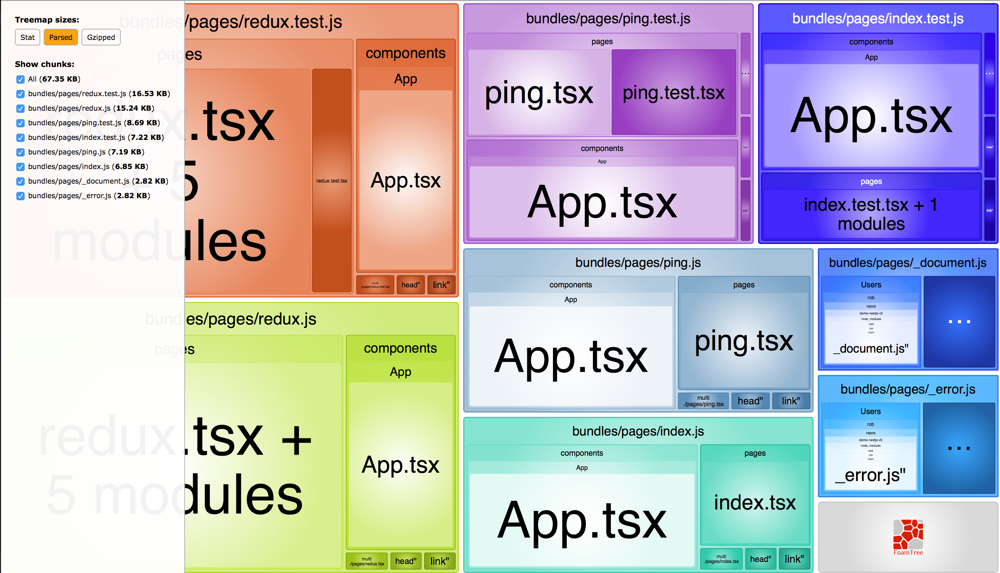

# Welcome
This is a simple demo to explore NextJS v5 with support for:
+ Jest / Enzyme
+ Redux
+ TypeScript
+ Webpack
    
This project even uses `tslint` to make sure the code is clean before a commit can even occur.

## Development
To verify NextJS is running in development mode, you can simply run:
    $ npm run dev

To verify the ExpressJS server is running in development mode, you should be able to see a response from [http://localhost:3000/test](http://localhost:3000/test) to verify the back-end Express server is running.

### What's in the bundle?
This project includes a helper script that will enable you to interactively explore what is contained within your production app. Simply run:

#### Bundle size
```sh
$ npm run analyze
```

This will generate an interactive tool to see what the generated bundles for your app contain:


### Testing
This project uses [jest](https://facebook.github.io/jest/) and [enzyme](http://airbnb.io/enzyme/) for testing your React application - and should have 100% code coverage:

If you are not seeing 100% code coverage, that is sad...truly sad. Let's figure out a way to make sure we have a testable design instead of some crap that "just works...until it doesn't."

For testing, we have the following scripts I have lovingly crafted in our main `package.json` file:

```sh
    "test": "./node_modules/.bin/jest --no-cache",
    "test:debug": "./node_modules/.bin/jest --debug",
    "test:verbose": "./node_modules/.bin/jest --verbose",
    "test:watch": "./node_modules/.bin/jest --watch"
    "test:coverage": "npm test -- --coverage --no-cache",
    "test:coverage:view": "npm test -- --coverage --no-cache && open coverage/lcov-report/index.html",
```

To run the tests:
```sh
$ npm run <script>
```

Let's take a peek at what each one of the test scripts has to offer.

#### npm run test
This script will run any file(s) that matches the pattern specified in our `jest.config.js` - which is usually any file that contains `.test.` in the name.

#### npm run test:debug
Similar to the above command, this will output debug information for your jest setup and then run through any file(s) that matches the pattern specified in our `jest.config.js` - which is usually any file that contains `.test.` in the name.

#### npm run test:verbose
Similar to `npm run test`, this script will run any file(s) that matches the pattern specified in our `jest.config.js` - which is usually any file that contains `.test.` in the name - and display a verbose output of the tests that were executed.

#### npm run test:watch
This script should be your best friend. It will quietly sit in the background as you make changes and run tests that are affiliated with any and all files you modify.

#### npm run test:coverage
This script will allow you to see how much test coverage you have for your project. Certain files may be excluded from this report (see `collectCoverageFrom` in `jest-config.js`) for more details.

```sh

 PASS  redux/enthusiasm/actions/index.test.tsx
 PASS  redux/enthusiasm/reducers/index.test.tsx
 PASS  redux/store/index.test.tsx
 PASS  pages/ping.test.tsx
 PASS  pages/index.test.tsx
 PASS  pages/redux.test.tsx
---------------------------|----------|----------|----------|----------|----------------|
File                       |  % Stmts | % Branch |  % Funcs |  % Lines |Uncovered Lines |
---------------------------|----------|----------|----------|----------|----------------|
All files                  |    90.85 |     72.5 |    88.89 |    95.92 |                |
 components/App            |      100 |      100 |      100 |      100 |                |
  App.tsx                  |      100 |      100 |      100 |      100 |                |
 pages                     |    91.76 |    69.39 |    88.89 |    90.91 |                |
  index.tsx                |      100 |      100 |      100 |      100 |                |
  ping.tsx                 |      100 |      100 |      100 |      100 |                |
  redux.tsx                |    89.23 |    63.41 |    85.71 |     87.5 |          31,36 |
 redux/enthusiasm/actions  |      100 |      100 |      100 |      100 |                |
  index.tsx                |      100 |      100 |      100 |      100 |                |
 redux/enthusiasm/reducers |    75.86 |    68.42 |    66.67 |      100 |                |
  index.tsx                |    75.86 |    68.42 |    66.67 |      100 |            1,4 |
 redux/enthusiasm/types    |      100 |      100 |      100 |      100 |                |
  enthusiasm.ts            |      100 |      100 |      100 |      100 |                |
  initialState.ts          |      100 |      100 |      100 |      100 |                |
 redux/store               |      100 |     87.5 |      100 |      100 |                |
  index.tsx                |      100 |     87.5 |      100 |      100 |              5 |
  root-action.ts           |      100 |      100 |      100 |      100 |                |
  root-reducer.ts          |      100 |      100 |      100 |      100 |                |
  root-state.ts            |      100 |      100 |      100 |      100 |                |
---------------------------|----------|----------|----------|----------|----------------|

Test Suites: 6 passed, 6 total
Tests:       13 passed, 13 total
Snapshots:   0 total
Time:        4.385s
```

#### npm run test:coverage:view
Similar to the above command, this script will run the code coverage test and open up your browser (on the Mac only) to view an interactive report to see what code is and is not covered adequately.

Don't have a Mac? No problem. Fire up your favorite web browser and open [coverage/lcov-report/index.html](coverage/lcov-report/index.html)

## Production
To verify NextJS is running in production mode, you can simply run:
    $ npm run start

To verify the ExpressJS server is running in development mode, you should be able to see a response from [http://localhost:3000/test](http://localhost:3000/test) to verify the back-end Express server is running.

# Feedback
Please feel free to [create an issue](https://github.com/TheRobBrennan/demo-nextjs-v5/issues) if you have a question or idea for this project.