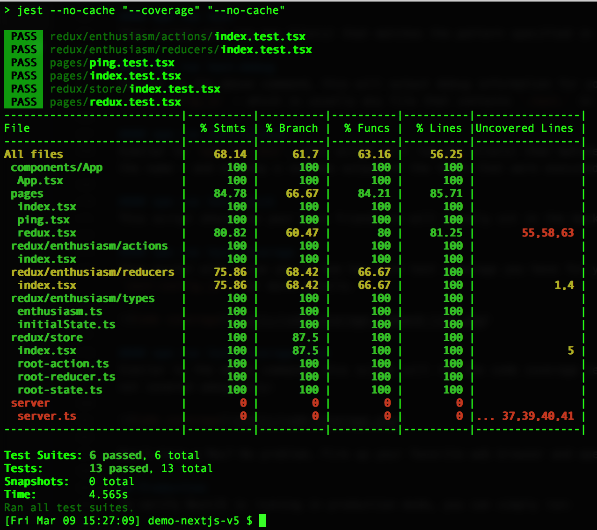

# Welcome
This is a simple demo to explore NextJS v5 with support for:
+ [Jest](https://facebook.github.io/jest/) / [Enzyme](http://airbnb.io/enzyme/)
+ [Redux](https://redux.js.org)
    - [Redux DevTools](https://github.com/zalmoxisus/redux-devtools-extension)
        + Currently supports viewing and debugging your Redux store in
            - Chrome
            - Firefox
            - Electron
        + Please see [remote-redux-devtools](https://github.com/zalmoxisus/remote-redux-devtools) for other browsers/environments
+ [TypeScript](https://www.typescriptlang.org)
+ [Webpack](https://webpack.js.org)

This project even uses [tslint](https://palantir.github.io/tslint/) and [pre-commit](https://www.npmjs.com/package/pre-commit) to make sure the code is clean before a commit can even occur.

A [demo](https://demo-nextjs5.herokuapp.com/) of this project can be viewed on [Heroku](https://demo-nextjs5.herokuapp.com/) at [https://demo-nextjs5.herokuapp.com/](https://demo-nextjs5.herokuapp.com/)

## Key features
There are a few key things that I wanted to achieve with this demo:

+ Incorporate the new NextJS 5 with TypeScript and Redux
    - Incorporate Redux DevTools for viewing and debugging the Redux store
+ Incorporate Jest and Enzyme for testing the application
    - My original goal was to have as close to 100% test coverage as REASONABLY POSSIBLE
+ Incorporate a back-end [ExpressJS](http://expressjs.com) server for handling custom server routes

Let's dive into these a bit more...or feel free to skip ahead to "Development".

### TypeScript
This project allows you to have both standard JavaScript and TypeScript code in your project.

If you need to make any modifications to the TypeScript configuration, please see `tsconfig.json`

### Redux
To demonstrate incorporating Redux with TypeScript and NextJS, I used the [original example](https://github.com/Microsoft/TypeScript-React-Starter#typescript-react-starter) from Microsoft at [https://github.com/Microsoft/TypeScript-React-Starter#typescript-react-starter](https://github.com/Microsoft/TypeScript-React-Starter#typescript-react-starter) as a base

If you have Redux DevTools installed, you will see something similar to:


**BONUS: You can have the back-end server preload state. Keep reading.**

### ExpressJS server
This demo uses a lightweight ExpressJS server - `server.js` - to demonstrate how to:

+ Demonstrate how to create an endpoint (for an API, as an example) that does not use NextJS
+ Demonstrate how to server-side render (SSR) NextJS pages
+ Demonstrate server side rendering (SSR) for custom route/paths

#### Endpoint that does not use NextJS
##### /test
This example path is a route that our NextJS app knows absolutely nothing about. It is purely handled by our Express server. You can ping this route to verify that the server is available.

#### Server side rendering (SSR) for NextJS pages
##### /ping
This is simple server side rendering (SSR) for the `ping.tsx` page

##### /redux
This is simple server side rendering (SSR) for the `redux.tsx` page.

NOTE: If the user is having the Redux store populate from the server (such as going to /redux initially or hard refreshing the page), we have special functionality that actually dispatches a few redux actions to pre-populate our store.

**IMPORTANT CONCEPT: The server will render a completely fresh Redux store. If you need to fire off events to pre-populate the store for a particular page, be sure to dispatch actions similar to the example below.**

```sh
  static getInitialProps({ store, isServer }: ReduxWrapper) {
    if (isServer) {
      // For examples of async actions, check out 
      //  https://github.com/kirill-konshin/next-redux-wrapper#async-actions-in-getinitialprops
      store.dispatch(actions.incrementEnthusiasm());
      store.dispatch(actions.incrementEnthusiasm());
      store.dispatch(actions.incrementEnthusiasm());
      store.dispatch(actions.incrementEnthusiasm());
    }
    return { custom: 'customText' };
  }
```

#### Server side rendering (SSR) for custom routes
This example uses the `ping.tsx` as the page we want to render when handling custom routes.

##### Client configuration
In `components/App/App.tsx` notice that we have the following code block:

```sh
      <Link as={`/people`} href={`/ping`}><a>People</a></Link>&nbsp;
      <Link as={`/people/developers`} href={`/ping?slug=developers`}><a>Developers</a></Link>&nbsp;
      <Link as={`/people/developers/rob`} href={`/ping?slug=developers&name=rob`}><a>Rob</a></Link>&nbsp;
```

This tells NextJS that these links will render the `ping.tsx` page, but that we want the URLs to appear as `/people/...` and not just a link to `/ping?slug=developers&name=rob`.

This setup will work fine on the client side...until they try to access the `/people/...` route directly or refresh the web page. To get that to work, we need to modify our lightweight server to explicitly handle those routes.

##### Server configuration
Notice that in our `server.js` file we have the following block of code:

```sh
    server.get('/people', (req, res) => {
      const actualPage = '/ping'
      const queryParams = { }
      app.render(req, res, actualPage, queryParams)
    })

    server.get('/people/:slug', (req, res) => {
      const actualPage = '/ping'
      const queryParams = { slug: req.params.slug, name: req.params.name }
      app.render(req, res, actualPage, queryParams)
    })

    server.get('/people/:slug/:name', (req, res) => {
      const actualPage = '/ping'
      const queryParams = { slug: req.params.slug, name: req.params.name }
      app.render(req, res, actualPage, queryParams)
    })
```

All three of these custom routes render the `ping.tsx` page with the appropriate parameters passed in. This means the user will be able to navigate to the following example URLs in their browser OR by forcing a hard refresh on the server:

+ /people
+ /people/developers
+ /people/developers/Rob

## Development
To verify NextJS is running in development mode, you can simply run:

    $ npm run dev

To verify the ExpressJS server is running in development mode, you should be able to see a response from [http://localhost:3000/test](http://localhost:3000/test) to verify the back-end Express server is running.

### What's in the bundle?
This project includes a helper script that will enable you to interactively explore what is contained within your production app. Simply run:

```sh
$ npm run analyze
```

This will generate an interactive tool to see what the generated bundles for your app contain:


### Testing
This project uses [jest](https://facebook.github.io/jest/) and [enzyme](http://airbnb.io/enzyme/) for testing your React application - and should have high levels of code coverage.

For testing, we have the following scripts I have lovingly crafted in our main `package.json` file:

```sh
    "test": "./node_modules/.bin/jest --no-cache",
    "test:debug": "./node_modules/.bin/jest --debug",
    "test:verbose": "./node_modules/.bin/jest --verbose",
    "test:watch": "./node_modules/.bin/jest --watch"
    "test:coverage": "npm test -- --coverage --no-cache",
    "test:coverage:view": "npm test -- --coverage --no-cache && open coverage/lcov-report/index.html",
```

To run the tests:
```sh
$ npm run <script>
```

Let's take a peek at what each one of the test scripts has to offer.

#### npm run test
This script will run any file(s) that matches the pattern specified in our `jest.config.js` - which is usually any file that contains `.test.` in the name.

#### npm run test:debug
Similar to the above command, this will output debug information for your jest setup and then run through any file(s) that matches the pattern specified in our `jest.config.js` - which is usually any file that contains `.test.` in the name.

#### npm run test:verbose
Similar to `npm run test`, this script will run any file(s) that matches the pattern specified in our `jest.config.js` - which is usually any file that contains `.test.` in the name - and display a verbose output of the tests that were executed.

#### npm run test:watch
This script should be your best friend. It will quietly sit in the background as you make changes and run tests that are affiliated with any and all files you modify.

#### npm run test:coverage
This script will allow you to see how much test coverage you have for your project. Certain files may be excluded from this report (see `collectCoverageFrom` in `jest-config.js`) for more details.



#### npm run test:coverage:view
Similar to the above command, this script will run the code coverage test and open up your browser (on the Mac only) to view an interactive report to see what code is and is not covered adequately:


Don't have a Mac? No problem. Fire up your favorite web browser and open [coverage/lcov-report/index.html](coverage/lcov-report/index.html)

## Production
To verify NextJS is running in production mode, you can simply run:

    $ npm run start

To verify the ExpressJS server is running in development mode, you should be able to see a response from [http://localhost:3000/test](http://localhost:3000/test) to verify the back-end Express server is running.

## Third party services
### Heroku
For advanced users, this project is ready for you to deploy to Heroku. All you need to do is create your Heroku app and deploy as usual. 

If you are familiar with this process, here is how you would create a new app on Heroku (free) using their [command-line tool](https://devcenter.heroku.com/articles/heroku-cli) for your account - where <APP_NAME> is whatever you want to call the application on Heroku:

    $ heroku create <APP_NAME>

To deploy your app to Heroku, you can use the quick helper script I created. This script has the benefit of determining what branch you are on, and automatically deploying that as the master branch to your Heroku app:

    $ npm run deploy:heroku

Note that there is a simpler script - `npm run deploy` - that is an alias to the Heroku command above. This is for convenience; and will allow easier changes in the future if the deploy target should be something other than Heroku.

We also have a script - `heroku-postbuild` - that needs to be included when deploying to Heroku. This will run the build script for our app (again) on the Heroku dyno itself.

#### BONUS: Heroku CLI scripts
Assuming you have the [Heroku command-line tool](https://devcenter.heroku.com/articles/heroku-cli) installed, there are additional scripts you may find useful:

+ heroku:bash
+ heroku:logs
+ heroku:logs:tail

##### npm run heroku:bash
This script will load a one-off dyno of your Heroku app. You will find this useful if you want to see what files are deployed to your app as well as the dyno itself. 

When you are finished, simply type `exit`.

In the example below, note that this dyno has been given an ID of 8505.

```sh
[Sat Feb 10 13:24:18] demo-nextjs-v5 $ npr heroku:bash

> demo-nextjs-v5@0.0.0 heroku:bash /Users/rob/repos/demo-nextjs-v5
> heroku run bash

Running bash on ⬢ demo-nextjs5... up, run.8505 (Free)
~ $ ls -al
total 516
drwx------  11 u33881 dyno   4096 Feb 10 21:28 .
drwxr-xr-x  15 root   root   4096 Jan 23 18:33 ..
-rw-------   1 u33881 dyno    237 Feb 10 21:14 .babelrc
-rw-------   1 u33881 dyno     27 Feb 10 21:14 .gitignore
drwx------   3 u33881 dyno   4096 Feb 10 21:14 .heroku
drwx------   5 u33881 dyno   4096 Feb 10 21:15 .next
drwx------   2 u33881 dyno   4096 Feb 10 21:14 .profile.d
-rw-------   1 u33881 dyno      0 Feb 10 21:14 @1
-rw-------   1 u33881 dyno     19 Feb 10 21:14 Procfile
-rw-------   1 u33881 dyno  10054 Feb 10 21:14 README.md
drwx------   2 u33881 dyno   4096 Feb 10 21:14 __mocks__
drwx------   3 u33881 dyno   4096 Feb 10 21:14 components
-rw-------   1 u33881 dyno    550 Feb 10 21:14 jest.config.js
-rw-------   1 u33881 dyno    120 Feb 10 21:14 jest.setup.js
-rw-------   1 u33881 dyno    461 Feb 10 21:14 next.config.js
drwx------ 966 u33881 dyno  36864 Feb 10 21:15 node_modules
-rw-------   1 u33881 dyno 396249 Feb 10 21:14 package-lock.json
-rw-------   1 u33881 dyno   2185 Feb 10 21:14 package.json
drwx------   2 u33881 dyno   4096 Feb 10 21:14 pages
drwx------   4 u33881 dyno   4096 Feb 10 21:14 redux
-rw-------   1 u33881 dyno   1658 Feb 10 21:14 server.js
drwx------   2 u33881 dyno   4096 Feb 10 21:14 static
-rw-------   1 u33881 dyno    531 Feb 10 21:14 tsconfig.json
-rw-------   1 u33881 dyno   2968 Feb 10 21:14 tslint.json
~ $ exit
exit
[Sat Feb 10 13:28:59] demo-nextjs-v5 $ 
```

##### npm run heroku:logs
This command will show you the most recent logs from your Heroku application.

In the example below, note that we are seeing logs for all of Heroku assets including:

+ Our `web` process - as declared in our `Procfile`
+ The one-off process we ran with our bash script (above) - `run.8505`

```sh
2018-02-10T21:15:45.460734+00:00 heroku[web.1]: State changed from up to starting
2018-02-10T21:14:39.000000+00:00 app[api]: Build succeeded
2018-02-10T21:15:46.371985+00:00 heroku[web.1]: Stopping all processes with SIGTERM
2018-02-10T21:15:46.470176+00:00 heroku[web.1]: Process exited with status 143
2018-02-10T21:15:51.706883+00:00 heroku[web.1]: Starting process with command `npm run start`
2018-02-10T21:15:53.897899+00:00 app[web.1]: 
2018-02-10T21:15:53.897916+00:00 app[web.1]: > demo-nextjs-v5@0.0.0 start /app
2018-02-10T21:15:53.897918+00:00 app[web.1]: > NODE_ENV=production node server.js -p $PORT
2018-02-10T21:15:53.897920+00:00 app[web.1]: 
2018-02-10T21:15:54.615032+00:00 app[web.1]: > Ready on http://localhost:48693
2018-02-10T21:15:54.827549+00:00 heroku[web.1]: State changed from starting to up
2018-02-10T21:16:02.547447+00:00 heroku[router]: at=info method=GET path="/" host=demo-nextjs5.herokuapp.com request_id=cfec0645-12d6-426d-b621-3f2ee288c976 fwd="71.231.84.146" dyno=web.1 connect=1ms service=150ms status=200 bytes=2112 protocol=https
2018-02-10T21:16:02.754269+00:00 heroku[router]: at=info method=GET path="/_next/ac03bee3-59d2-4a1c-a0f8-3fe13d0e7376/page/index.js" host=demo-nextjs5.herokuapp.com request_id=95ad7956-5030-4aa8-a60a-20f7a8b2ed98 fwd="71.231.84.146" dyno=web.1 connect=1ms service=14ms status=200 bytes=842 protocol=https
2018-02-10T21:16:02.866598+00:00 heroku[router]: at=info method=GET path="/_next/static/style.css" host=demo-nextjs5.herokuapp.com request_id=8cd182f2-f42e-4f95-add4-589b249bee14 fwd="71.231.84.146" dyno=web.1 connect=1ms service=14ms status=404 bytes=2654 protocol=https
2018-02-10T21:16:02.968406+00:00 heroku[router]: at=info method=GET path="/_next/ac03bee3-59d2-4a1c-a0f8-3fe13d0e7376/page/_error.js" host=demo-nextjs5.herokuapp.com request_id=328aba99-dbae-4223-a1cb-5ca7fa5766db fwd="71.231.84.146" dyno=web.1 connect=1ms service=4ms status=200 bytes=5204 protocol=https
2018-02-10T21:16:03.068829+00:00 heroku[router]: at=info method=GET path="/_next/8440abd45174b3d5c8841dd3da4ac4bf/app.js" host=demo-nextjs5.herokuapp.com request_id=d5281312-94b0-4f8f-805d-c1611a9d09d5 fwd="71.231.84.146" dyno=web.1 connect=1ms service=11ms status=200 bytes=211138 protocol=https
2018-02-10T21:16:06.241228+00:00 heroku[router]: at=info method=GET path="/_next/ac03bee3-59d2-4a1c-a0f8-3fe13d0e7376/page/ping.js" host=demo-nextjs5.herokuapp.com request_id=e70432d7-f7fd-4fcc-acf9-8bdb2b44d729 fwd="71.231.84.146" dyno=web.1 connect=2ms service=6ms status=200 bytes=1138 protocol=https
2018-02-10T21:16:11.760415+00:00 heroku[router]: at=info method=GET path="/_next/ac03bee3-59d2-4a1c-a0f8-3fe13d0e7376/page/redux.js" host=demo-nextjs5.herokuapp.com request_id=9db8f477-8ddb-476d-89fc-1114c6a10147 fwd="71.231.84.146" dyno=web.1 connect=1ms service=7ms status=200 bytes=104342 protocol=https
2018-02-10T21:28:35.467840+00:00 app[api]: Starting process with command `bash` by user rob@therobbrennan.com
2018-02-10T21:28:41.274979+00:00 heroku[run.8505]: Awaiting client
2018-02-10T21:28:41.318132+00:00 heroku[run.8505]: Starting process with command `bash`
2018-02-10T21:28:41.536376+00:00 heroku[run.8505]: State changed from starting to up
2018-02-10T21:28:59.211667+00:00 heroku[run.8505]: Process exited with status 0
2018-02-10T21:28:59.226888+00:00 heroku[run.8505]: State changed from up to complete
```

##### npm run heroku:logs:tail 
This command is similar to `npm run heroku:logs` - with the only difference being that this tails the live output of all Heroku logs for your application. You can cancel or interrupt this at any point with CTRL+C.

### Codeship CI/CD
This project uses Codeship Continuous Integration and Continuous Deployment - installed as an add-on to the Heroku app.

If you are installing on Heroku, you'll want to make sure you have defined the appropriate HEROKU_API_KEY config variable.

# Feedback
Please feel free to [create an issue](https://github.com/TheRobBrennan/demo-nextjs-v5/issues) if you have a question or idea for this project.